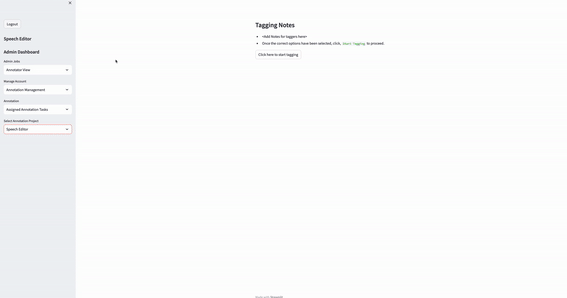

# Speech Editor

The ability to exert precise control over generated speech is crucial for many applications in which TTS systems are used. Models such as FastSpeech2 do technically offer direct control over F0, energy and duration. However, for users to control these features, a sensible user interface is required. A HitL system is often limited in its effectiveness by the user-friendliness of the provided user interface. Recognizing this, we developed a web-based User Interface (UI) designed specifically for the controllable TTS system. The primary objective of this UI is to bridge the technical complexities of the variance adaptor with a user-friendly interface, enabling users to make meaningful edits to synthesized utterances in a manner that is reliable, interpretable, and faithful to the user’s intent.

